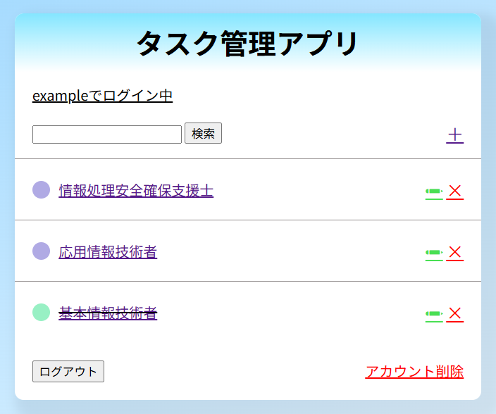

# Django Todo App

このDjangoアプリは、簡単なタスク管理を行えるWebアプリケーションです。


## 画面イメージ




## フォルダ構成
```plaintext
Todo_app_Django/
├── images/             # スクリーンショット画像
├── todoproject/        # Djangoプロジェクト本体
│   ├── static/         # 静的ファイル(CSS)
│   ├── templates/      # HTMLテンプレート
│   ├── todoapp/        # タスク管理アプリ
│   ├── todoproject/    # 設定ファイル（settings.pyなど）
│   └── manage.py       # 管理コマンド用エントリポイント
├── .env                # 環境変数ファイル（手動作成）
├── .gitignore          # Git追跡除外ファイル
├── requirements.txt    # 依存パッケージ定義
├── README.md           # このファイル
└── venv/               # 仮想環境（git除外対象）
```


## セットアップ手順

以下の手順でローカル環境でアプリを起動できます。

### 1. リポジトリのクローン

```bash
git clone https://github.com/Nikitty1226/Todo_app_Django.git
cd Todo_app_Django
```

### 2. 仮想環境の作成と有効化（任意）

```bash
python -m venv venv
source venv/bin/activate
```

### 3. 依存パッケージのインストール

```bash
pip install -r requirements.txt
```

### 4. .env ファイルの作成
プロジェクトルート（Todo_app_Django/）に .env ファイルを作成します。（以下は例です）：

```text
SECRET_KEY=your-secret-key-here
DEBUG=True
DB=sqlite:///db.sqlite3
```

### 5. データベースマイグレーション

```bash
cd todoproject
python manage.py migrate
```

### 6. 開発サーバーの起動

```bash
python manage.py runserver
```
ブラウザで以下のURLにアクセスします：
```text
http://127.0.0.1:8000/
```

## 参考元
[【Djangoアプリ開発】たった5日で本格的なTodoリストを構築してDjangoを学べるWebアプリ開発入門講座](https://www.udemy.com/course/django-todoapp-in-5day/)


## 作者
**Masayoshi Niki**  
IoT技術者／クラウドアプリエンジニア志望<br>
GitHub: [@Nikitty1226](https://github.com/Nikitty1226)